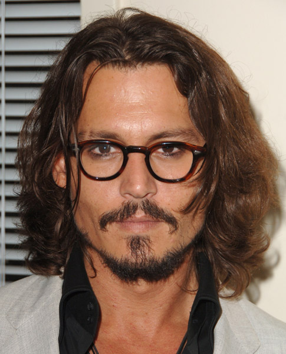
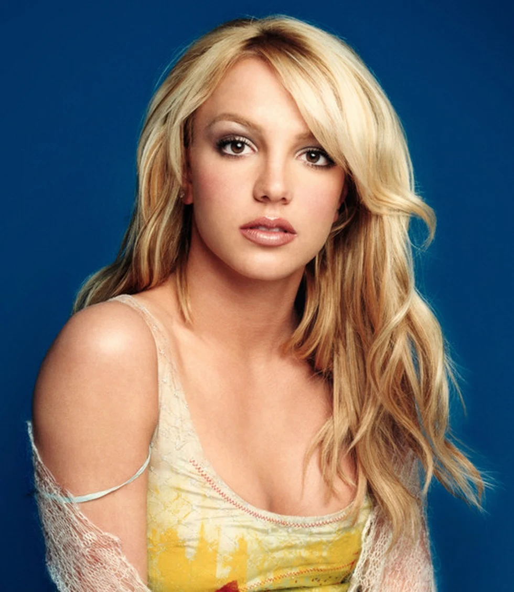
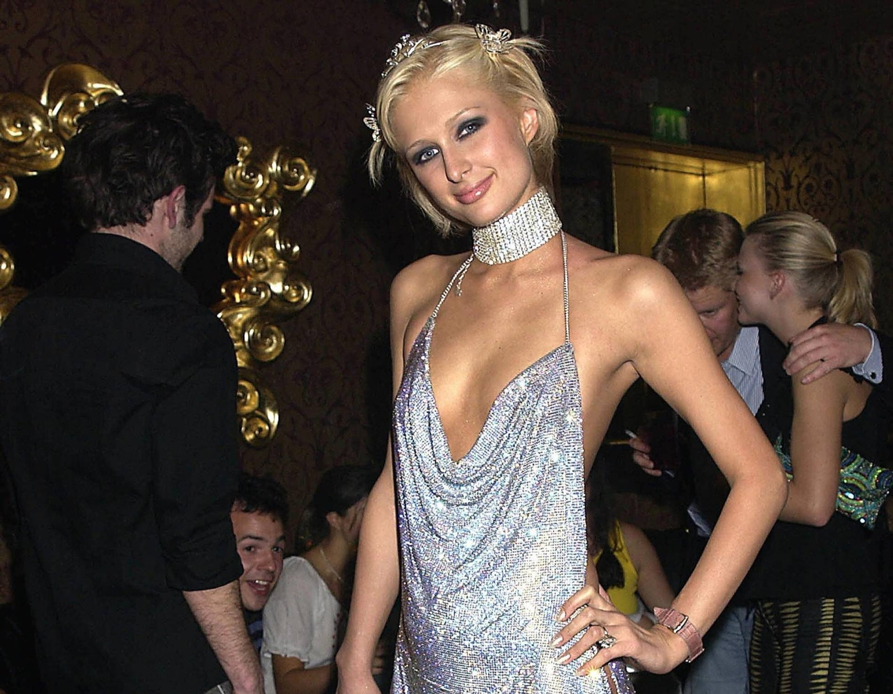

# ДЗ 3. Sampling в латентном пространстве StyleGAN

Датасет: Angelina Jolie, Eddie Murphy, Kim Jun Jin, Leonardo DiCaprio, Jason Statham.

---

## 1. Проекция

Сначала выравниваю лица через dlib (68 точек), потом проецирую двумя способами:
- **e4e** — энкодер, один проход, быстро, но не идеально
- **оптимизация** — градиентный спуск по LPIPS + reg, 150 шагов, заметно чище

---

## 2. Style Transfer

Crossover в W+: слои 0–7 берём от оригинала (форма, поза), слои 8–17 заменяем на стиль (цвет, текстура, освещение).
| style1 | style2 | style3 |
|--------|--------|--------|
|  |  |  |

---

## 3. Expression Transfer

Применяю готовые direction-векторы из editing/. Интерполяция по слоям 0–6 с разным ψ:

| Атрибут | ψ |
|---------|---|
| Smile | 0.5 |
| Age | 0.5 |
| Pose | 0.4 |

---

## 4. Face Swap

Оптимизирую W+ с двумя лоссами: ArcFace тянет к личности донора, LPIPS сохраняет позу и освещение атрибут-донора.
---

## Вывод

e4e даёт приемлемый результат сразу, но теряет мелкие детали - дополнительная оптимизация
заметно улучшает качество, особенно на сложных лицах вроде Эдди Мёрфи где e4e сильно
осветлил кожу.

Style transfer работает хорошо, когда стили контрастные.

Expression transfer с pose вышел самым слабым, поворот едва заметен, видимо ψ=0.4
маловато, стоило попробовать 0.6-0.8. Smile и Age работают стабильно на всех персонажах.

Face swap лучше всего получился когда позы у донора и реципиента близкие. Там где поза
сильно отличается (AJoly -> EMerphy) лицо переносится но с заметным смешением формы головы.
