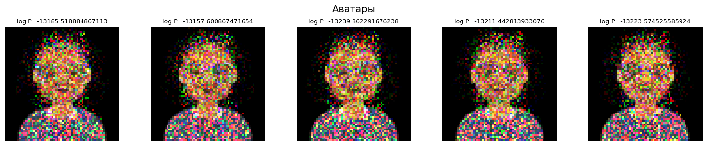
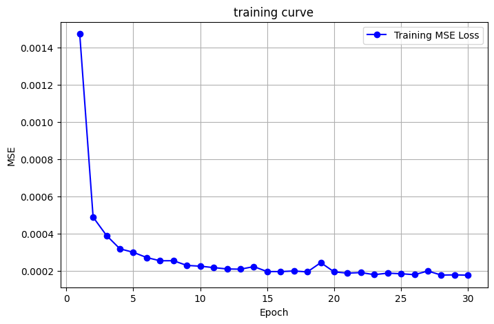
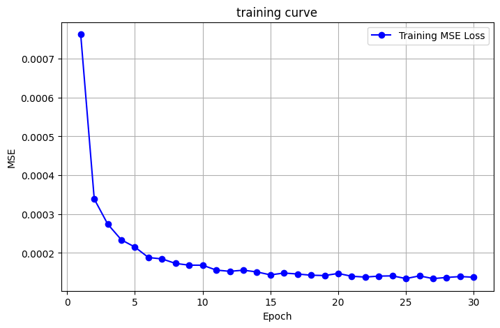
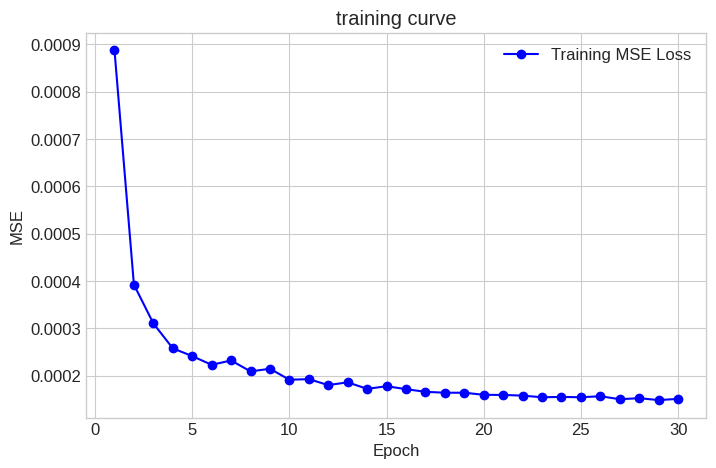
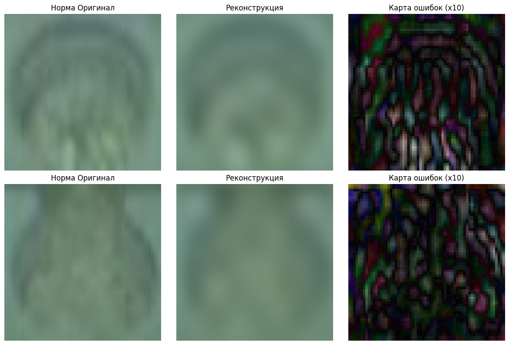
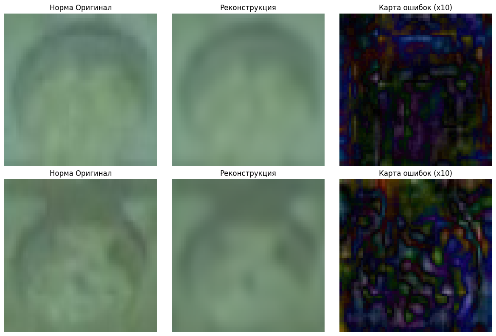
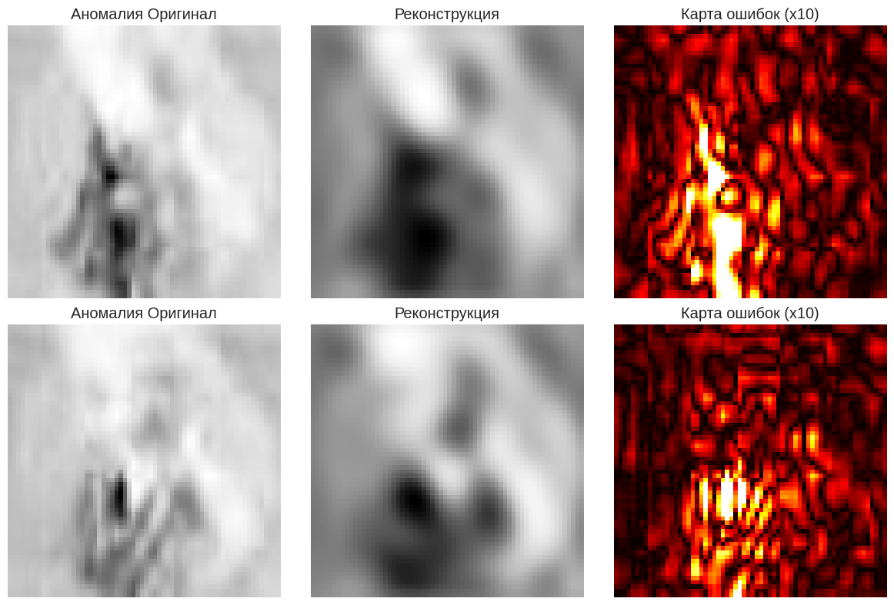
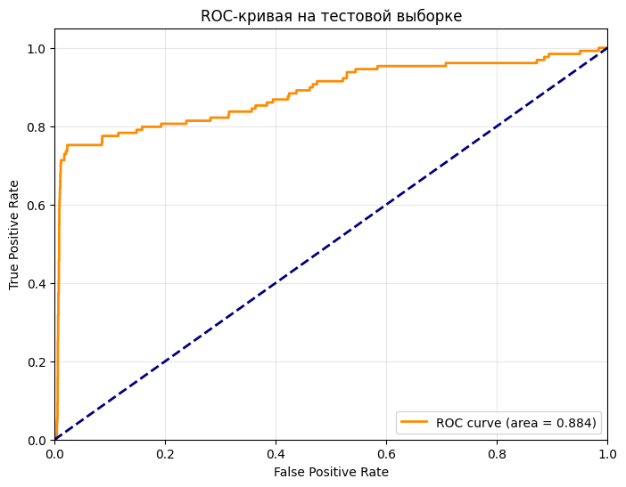
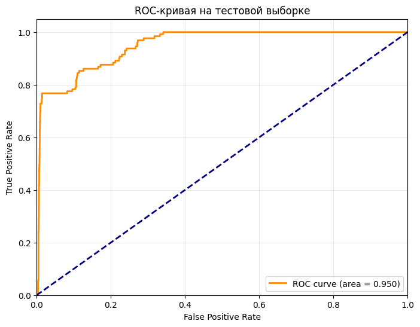
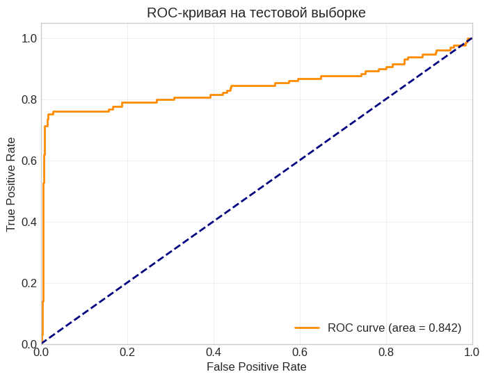

# Домашнее задание 1 — Детекция аномалий и байесовская генерация

## Задача

**Часть 1.** Байесовский генератор стилей и аватаров.

**Часть 2.** Детекция аномалий на изображениях с помощью автоэнкодера.

---

## Часть 1. Байесовская генерация

### Генерация стилей

MLE-оценка вероятностей каждого атрибута из styles_count.

Пример генерации:
    прическа: нет волос
    цвет волос: серебристо серый
    аксесуар: круглые очки
    одежда: комбинезон
    цвет одежды: розовый
    
Вероятность: 0.001703

### Генерация аватаров 

Для каждого пикселя и каждого канала (R, G, B) строится MLE-распределение по 256 значениям яркости на основе 11 аватаров
из датасета. Новые изображения сэмплируются попиксельно независимо.

Примеры сгенерированных изображений:

### Вывод по первой части

Сгенерированные аватары содержат силуэт головы и тела из-за того, что MLE-распределение в каждом
пикселе концентрируется вокруг среднего по датасету, а не сэмплирует случайный шум, пиксели фона практически детерминированы, в местах волос и одежды значения пикселей варьируются, поэтому возникает шум. Метод работает как попиксельный байесовский генератор без учета зависимостей между соседними пикселями, поэтому структура сохраняется на уровне среднего образа, а детали зашумлены.

---

## Часть 2. Детекция аномалий

### Архитектура

Использовала три подхода:

1) Базовый автоэнкодер из conv, relu, maxpool
2) Первый подход + batchnorm + dropout
3) Оставляем только 1 канал, conv, relu, maxpool

Графики обучения:

Реконструкции:

Метрики:

###  Результаты

|   Metric |Baseline  |Base+bn+do|One channel|
| -------- | -------- | -------- | ----------|
|   TPR    | 0.7984   | 0.7907   |  0.8062   |
|   TNR    | 0.8196   | 0.8936   |  0.6128   |

