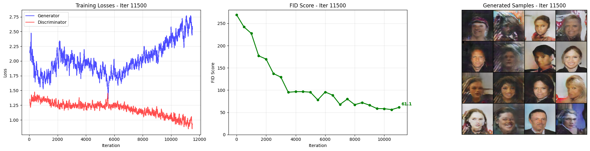
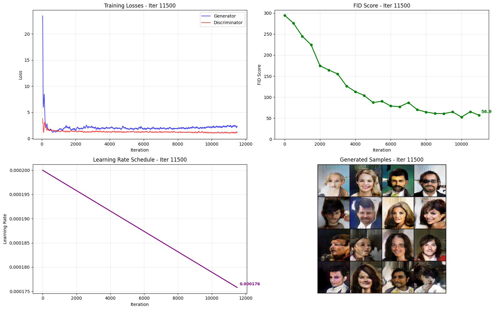
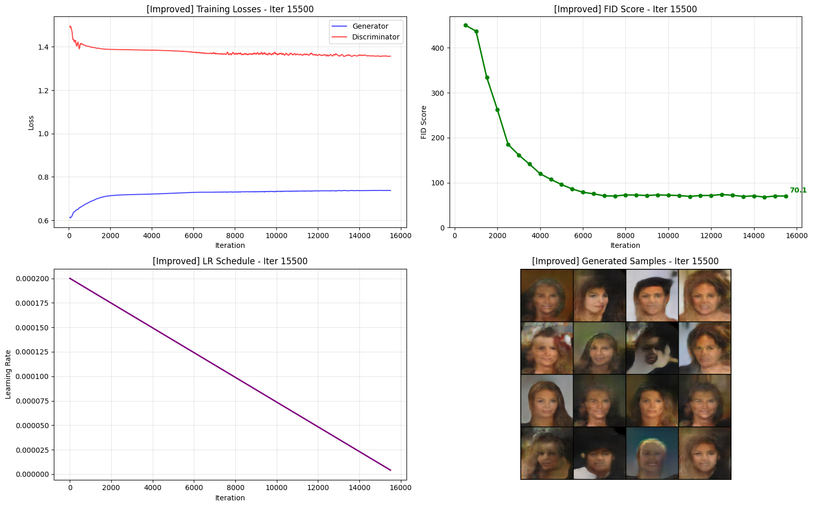

# Домашнее задание 2 — GAN для генерации лиц

## Задача

Генерация реалистичных изображений человеческих лиц с помощью Generative Adversarial Network

**Датасет:** CelebA
- ~202 599 изображений лиц знаменитостей
- Resize 128 * 128, нормализация

---

## Архитектура

### Генератор
Как в постановке задачи

### Дискриминатор

Свёрточная сеть с LeakyReLU(0.2), BN

---

## Метрика качества

InceptionV3 извлекает признаки из реальных и сгенерированных изображений,
затем сравниваются их распределения:

$$\text{FID} = \|\mu_r - \mu_g\|^2 + \text{Tr}\!\left(\Sigma_r + \Sigma_g - 2\sqrt{\Sigma_r \Sigma_g}\right)$$

Чем меньше FID - тем ближе распределение сгенерированных изображений к 
реальным.

---

## Эксперименты

### Эксперимент 1 - baseline

| Параметр | Значение |
|---|---|
| Loss | BCE |
| Оптимизатор G / D | Adam |
| Learning rate | 2e-4 |
| LR Scheduler | - |
| Epoch | 4.5 |

Итоговый FID - 61

### Эксперимент 2 — baseline + lr scheduler + grad clipping

| Параметр | Значение |
|---|---|
| Loss | BCE |
| Оптимизатор G / D | Adam |
| Learning rate | 2e-4 |
| LR Scheduler | Linear |
| Epoch | 4.5 |

Итоговый FID - 57

### Эксперимент 3 — baseline + lr scheduler + grad clipping + MinibatchStdDev + EMA

| Параметр | Значение |
|---|---|
| Loss | BCE |
| Оптимизатор G / D | Adam |
| Learning rate | 2e-4 |
| LR Scheduler | Linear |
| Epoch | 5 |

Итоговый FID - около 70

---

### Результаты

Примеры генераций, графики лоссов и FID находятся в ноутбуке.

Во время обучения бейзлайна часть можно было видеть на всех 16 картинках похожие лица, с разным фоном, это происходит из-за мод коллапса, для борьбы с ним может помочь MinibatchStdDev, разница между лоссами довольна большая и меньший лосс у дискриминатора, он хорошо обучился отличать фейковые изображения.

Первый и второй подход были практически идентичны, но клиппинг градиентов во втором подходе чуть стабилизировал обучение, лица получились более отчетливые по сравнению с бейзлайном, разница между лоссами стала ниже, что сделало обучение более стабильным.

EMA и MinibatchStdDev: первые 3000 шагов генерировались серые изображения, тк траектория обучения сглаживалась, сэмплы полученные после обучения получились лучше, метрика FID особо не изменилась, эффективность EMA зависит от гиперпараметров и для более качественного результата нужно подобрать decay, разница между лоссами небольшая, но интересно, что теперь лосс дискриминатора выше.
