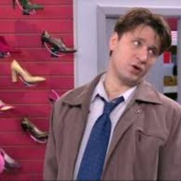

# ДЗ 4. Обучение Stable diffusion 1.5 методом Dreambooth

https://huggingface.co/docs/diffusers/training/dreambooth

## Идея Dreambooth
text to image модель генерирует изображения по какому-то распределению, например по запросу **a photo of woman face**, модель генерирует фотографию рандомной женщины. Мы хотим сгенерировать фотографию конкретной женщины, фотографий которой не было датасета при обучении модели, но если обучать модель на небольшом наборе, то неизбежно будем терять уже имеющие знания модели. Dreambooth отчасти решает эту проблему обучая модель в два этапа, на нашем датасете **instance images** и на регуляризационном датасете **class images**, который собирается из генераций модели.

## Датасет
В качестве датасета я собрала 15 изображений Гены Букина, кропнула и заресайзила их до 256x256, постаралась подобрать разные ракурсы и кадры, датасет в папке dataset.

Таблица 1. Пример изображений для обучения

## Обучение SD 1.5 

#### Параметры
**--instance_prompt="a photo of sks woman face"** токен на который мы хотим обучить персонажа 

**--class_prompt="a photo of man face"** промт для регуляризации

Чтобы модель не забывала уже то, что знает и не переобучилась, используется регуляризационный датасет (class images генерируются автоматически по промту class_prompt). Для более качественного результата можете самостоятельно собрать этот набор.

Примеры генераций внутри ноутбука, видно, что модель неплохо уловила черты лица, прическу, есть внешнее сходство.

## Обучение LoRA модели

Обучила LoRA с 3 разными параметрами ранга: 4, 8, 16, время обучения было практически одинаковое - около 4 минут, в 3 раза меньше, чем при обучении unet. Качество генерации вышло неплохим для всех ранков, но иногда виднеются артефакты, на изображениях с кухней видно как перенесся стиль кухни из сериала. 

Примеры генераций и сравнение с ноутбуке.

## Сравнить лучший чекпоинт Unet и Lora

Сравнивала unet и LoRA  с ранком 8, изображения, сгенерированные LoRA нравтяся мне чуть больше, на фото в лесу unet сгенерировала изображение с лицом другого мужчины.

## ControlNet

Использовала "lllyasviel/ControlNet" и йога позы, чтобы перенести их на изображение. В итоге получились крупные изображения лица с артефактами в виде извлеченных поз, я предполагаю, что это произошло из-за того, что в датасете было недостаточно изображений персонажа в полный рост, модель не смогла их сгенерировать в таком виде и попыталась вписать лицо в извлеченные линии.
